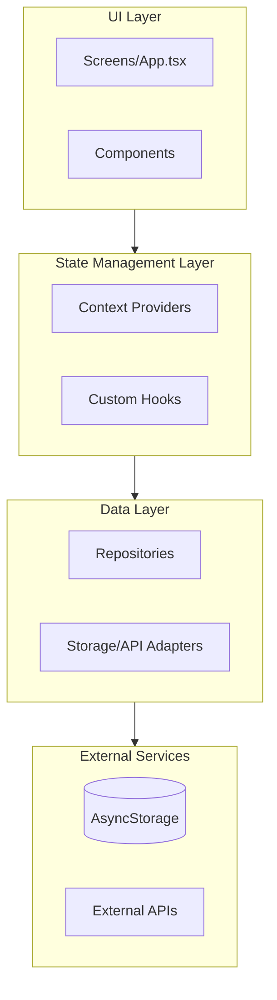

# Coding Guidelines

## A1 — Layered Architecture

Follow a strict layered architecture with clear separation of concerns and unidirectional data flow.

### Architecture Diagram



### Dependency Direction

**Always**: UI → State → Data → External  
**Never**: Reverse dependencies (e.g., Data layer should never import from UI layer)

### Layer Responsibilities

#### `src/types/` — Pure TypeScript Interfaces

- Contains only TypeScript interfaces/types
- **No React dependencies** (no imports from 'react')
- No business logic
- Shared across all layers

**Do**

```ts
// src/types/DeviceInfo.ts
export interface DeviceInfo {
  id: string;
  createdAt: string;
}
```

**Don't**

```ts
// ❌ Don't import React in types
import { ReactNode } from 'react';
```

#### `src/data/storage/` — Storage Adapters

- Thin wrappers around external storage (AsyncStorage, API clients)
- Handle serialization/deserialization
- Provide typed interfaces for storage operations
- Should be easily swappable (e.g., AsyncStorage → API client)

**Do**

```ts
// src/data/storage/StorageAdapter.ts
export class StorageAdapter {
  async get<T>(key: string): Promise<T | null> {
    /* ... */
  }
  async set<T>(key: string, value: T): Promise<void> {
    /* ... */
  }
}
```

**Don't**

```ts
// ❌ Don't include business logic in adapters
async getDeviceInfo(): Promise<DeviceInfo> {
  // Business logic should be in repository
}
```

#### `src/data/repositories/` — Business Logic for Data Access

- Contain business logic for data operations
- Use adapters for actual storage/API calls
- Handle data transformation and validation
- Can use multiple adapters (storage + external APIs)

**Do**

```ts
// src/data/repositories/DeviceRepository.ts
export class DeviceRepository {
  constructor(private storage: StorageAdapter) {}

  async getOrCreateDeviceInfo(): Promise<DeviceInfo> {
    const existing = await this.storage.get<DeviceInfo>(KEY);
    if (existing) return existing;
    // Business logic for creating new device info
  }
}
```

**Don't**

```ts
// ❌ Don't access storage directly, use adapter
import AsyncStorage from '@react-native-async-storage/async-storage';
```

#### `src/providers/` — React Context Providers

- Manage React state (loading, error, data)
- Initialize repositories and adapters
- Provide state via Context API
- Can include custom hooks for consuming context

**Do**

```tsx
// src/providers/DeviceInfoProvider.tsx
export function DeviceInfoProvider({ children }: Props) {
  const [deviceInfo, setDeviceInfo] = useState<DeviceInfo | null>(null);
  const [loading, setLoading] = useState(true);

  useEffect(() => {
    const storage = new StorageAdapter();
    const repo = new DeviceRepository(storage);
    // Load data
  }, []);

  return <Context.Provider value={{ deviceInfo, loading }}>{children}</Context.Provider>;
}
```

**Don't**

```tsx
// ❌ Don't put business logic in providers
async function loadData() {
  const deviceId = await DeviceInfo.getUniqueId(); // Should be in repository
}
```

#### `src/hooks/` — Custom Hooks (Optional)

- Consume context providers
- Can be co-located with providers or separate
- Extract reusable logic from components

**Do**

```ts
// src/hooks/useDeviceInfo.ts or in provider file
export function useDeviceInfo() {
  const context = useContext(DeviceInfoContext);
  if (!context) throw new Error('Must be used within provider');
  return context;
}
```

#### Screens/Components — Pure UI

- Consume hooks/providers for data
- Handle user interactions
- Render UI based on state
- No direct data access

**Do**

```tsx
// App.tsx or Screen component
export function App() {
  const { deviceInfo, loading } = useDeviceInfo();

  if (loading) return <LoadingSpinner />;
  return <Text>{deviceInfo?.id}</Text>;
}
```

**Don't**

```tsx
// ❌ Don't access repositories directly from components
const repo = new DeviceRepository(new StorageAdapter());
```

### Swappability Principle

Adapters should be easily replaceable without changing repositories or UI code.

**Example**: Replace AsyncStorage with API client

- Only modify `StorageAdapter` implementation
- Repository and UI code remain unchanged

---

## RN1 — React Native Modern Practices

Follow React Native best practices for 2026.

### Functional Components Only

**Always** use functional components with hooks. **Never** use class components.

**Do**

```tsx
export function MyComponent({ title }: Props) {
  const [count, setCount] = useState(0);
  return (
    <Text>
      {title}: {count}
    </Text>
  );
}
```

**Don't**

```tsx
// ❌ Never use class components
class MyComponent extends React.Component {
  /* ... */
}
```

### Hooks-First Approach

Extract reusable logic into custom hooks.

**Do**

```tsx
function useCounter(initial = 0) {
  const [count, setCount] = useState(initial);
  const increment = useCallback(() => setCount(c => c + 1), []);
  return { count, increment };
}

export function Counter() {
  const { count, increment } = useCounter();
  return <Button onPress={increment} title={`Count: ${count}`} />;
}
```

### TypeScript Strict Mode

Use strong typing for all components, hooks, and functions.

**Do**

```tsx
interface Props {
  title: string;
  onPress: () => void;
}

export function Button({ title, onPress }: Props) {
  // ...
}
```

**Don't**

```tsx
// ❌ Avoid any types
export function Button({ title, onPress }: any) {
  /* ... */
}
```

### Container/Presentational Pattern

Separate data logic (containers) from UI (presentational components).

**Do**

```tsx
// Container: handles data
function DeviceInfoContainer() {
  const { deviceInfo, loading } = useDeviceInfo();
  return <DeviceInfoDisplay deviceInfo={deviceInfo} loading={loading} />;
}

// Presentational: pure UI
function DeviceInfoDisplay({ deviceInfo, loading }: Props) {
  if (loading) return <ActivityIndicator />;
  return <Text>{deviceInfo?.id}</Text>;
}
```

### Performance Patterns

#### React.memo for Expensive Pure Components

Use `React.memo` for components that are expensive to render and receive stable props.

**Do**

```tsx
export const ExpensiveComponent = React.memo(({ data }: Props) => {
  // Expensive rendering logic
});
```

**Don't**

```tsx
// ❌ Don't memoize everything - only when needed
export const SimpleText = React.memo(({ text }: Props) => <Text>{text}</Text>);
```

#### useMemo/useCallback Appropriately

Avoid premature optimization. Only use when:

- Expensive computations
- Preventing unnecessary re-renders (with React.memo)
- Stable function references needed for dependencies

**Do**

```tsx
const expensiveValue = useMemo(() => {
  return heavyComputation(data);
}, [data]);

const stableCallback = useCallback(() => {
  doSomething(id);
}, [id]);
```

**Don't**

```tsx
// ❌ Don't memoize simple operations
const simpleValue = useMemo(() => count + 1, [count]);
```

#### FlatList Optimization

Always provide `keyExtractor`. Use `getItemLayout` and `windowSize` when possible.

**Do**

```tsx
<FlatList
  data={items}
  keyExtractor={item => item.id}
  getItemLayout={(data, index) => ({
    length: ITEM_HEIGHT,
    offset: ITEM_HEIGHT * index,
    index,
  })}
  windowSize={5}
  renderItem={({ item }) => <ItemComponent item={item} />}
/>
```

### New Architecture Compatibility

Prefer Fabric/TurboModules-compatible libraries when available.

- Check library compatibility with React Native New Architecture
- Use libraries that support TurboModules when possible
- Enable New Architecture in `android/gradle.properties` and iOS config

### Styling

Use `StyleSheet.create()` for performance. Co-locate styles with components.

**Do**

```tsx
const styles = StyleSheet.create({
  container: {
    flex: 1,
    padding: 16,
  },
  title: {
    fontSize: 18,
    fontWeight: 'bold',
  },
});

export function Component() {
  return (
    <View style={styles.container}>
      <Text style={styles.title}>Title</Text>
    </View>
  );
}
```

**Don't**

```tsx
// ❌ Avoid inline styles for performance
<View style={{ flex: 1, padding: 16 }} />
```

---

## T1 — Testing Guidelines

Follow Jest + React Native Testing Library best practices.

### Test Behavior, Not Implementation

Query by text, role, or accessibility labels. Avoid testing internal state or implementation details.

**Do**

```tsx
import { render, screen } from '@testing-library/react-native';

test('displays device ID when loaded', async () => {
  render(<App />);
  expect(await screen.findByText(/device/i)).toBeTruthy();
});
```

**Don't**

```tsx
// ❌ Don't test implementation details
const component = render(<App />);
expect(component.getInstance().state.deviceInfo).toBeDefined();
```

### Use React Native Testing Library

Prefer `@testing-library/react-native` over `react-test-renderer` for better testing utilities.

**Do**

```tsx
import { render, screen, waitFor } from '@testing-library/react-native';
```

**Don't**

```tsx
// ❌ Avoid react-test-renderer for component tests
import ReactTestRenderer from 'react-test-renderer';
```

### Mock External Dependencies Only

Mock storage, APIs, and native modules. Keep tests high-fidelity by testing real React components.

**Do**

```tsx
jest.mock('@react-native-async-storage/async-storage');
jest.mock('react-native-device-info');

test('loads device info on mount', async () => {
  // Mock implementations
  render(<App />);
  // Test behavior
});
```

**Don't**

```tsx
// ❌ Don't mock React components unnecessarily
jest.mock('../components/DeviceDisplay');
```

### Test File Structure

- `__tests__/` at root for integration tests
- `*.test.ts(x)` co-located with source for unit tests (optional)

**Do**

```
src/
  components/
    Button.tsx
    Button.test.tsx        # Co-located unit test
  providers/
    DeviceInfoProvider.tsx
__tests__/
  App.test.tsx             # Integration test
```

### Custom Render Wrapper

Include providers in test utilities for consistent test setup.

**Do**

```tsx
// test-utils.tsx
import { render } from '@testing-library/react-native';
import { DeviceInfoProvider } from '../src/providers/DeviceInfoProvider';

export function renderWithProviders(ui: React.ReactElement) {
  return render(<DeviceInfoProvider>{ui}</DeviceInfoProvider>);
}

// In tests
test('component uses device info', () => {
  renderWithProviders(<MyComponent />);
});
```

### Hook Testing

Use `renderHook` for isolated hook tests.

**Do**

```tsx
import { renderHook } from '@testing-library/react-native';

test('useDeviceInfo returns loading state initially', () => {
  const { result } = renderHook(() => useDeviceInfo(), {
    wrapper: DeviceInfoProvider,
  });
  expect(result.current.loading).toBe(true);
});
```

### Cleanup

Use `afterEach(cleanup)` and `jest.clearAllMocks()` to prevent test pollution.

**Do**

```tsx
import { cleanup } from '@testing-library/react-native';

afterEach(() => {
  cleanup();
  jest.clearAllMocks();
});
```

### Use Shared Mock Factories

Use the mock factories in `src/__mocks__/repositories.ts` for consistent test setup. Avoid duplicating mock setup code across test files.

#### Available Mocks

| Factory | Returns | Use Case |
|---------|---------|----------|
| `createMockStorageAdapter()` | `MockStorageAdapter` | Testing repositories |
| `createMockRoundRepository()` | `jest.Mocked<RoundRepository>` | Testing services that depend on RoundRepository |
| `createMockProgressRepository()` | `jest.Mocked<ProgressRepository>` | Testing services that depend on ProgressRepository |

#### MockStorageAdapter

The `createMockStorageAdapter()` factory returns both the mock storage instance and individual mock functions for configuring test behavior:

**Do**

```tsx
import { createMockStorageAdapter, MockStorageAdapter } from '../../../__mocks__/repositories';
import { MyRepository } from '../MyRepository';

describe('MyRepository', () => {
  let repository: MyRepository;
  let mocks: MockStorageAdapter;
  let mockGet: jest.Mock;
  let mockSet: jest.Mock;

  beforeEach(() => {
    mocks = createMockStorageAdapter();
    ({ mockGet, mockSet } = mocks);

    repository = new MyRepository(mocks.storage);
  });

  it('should fetch data', async () => {
    mockGet.mockResolvedValue({ id: '123', name: 'Test' });

    const result = await repository.getById('123');

    expect(mockGet).toHaveBeenCalledWith('entity_123');
    expect(result).toEqual({ id: '123', name: 'Test' });
  });
});
```

**Don't**

```tsx
// ❌ Don't duplicate mock setup in each test file
let mockGet: jest.Mock;
let mockSet: jest.Mock;
// ... more mock declarations

beforeEach(() => {
  mockGet = jest.fn();
  mockSet = jest.fn();
  // ... more mock setup

  mockStorage = {
    get: mockGet,
    set: mockSet,
    // ... more methods
  } as unknown as jest.Mocked<StorageAdapter>;
});
```

#### Repository Mocks

For service tests, use the repository mock factories:

**Do**

```tsx
import { createMockRoundRepository } from '../../../__mocks__/repositories';

describe('MyService', () => {
  let mockRoundRepository: jest.Mocked<RoundRepository>;

  beforeEach(() => {
    mockRoundRepository = createMockRoundRepository();
  });

  it('should get active round', async () => {
    mockRoundRepository.getActiveRound.mockResolvedValue(mockRound);

    const service = new MyService(mockRoundRepository);
    const result = await service.execute();

    expect(result).toEqual(mockRound);
  });
});
```

---

## Agent Conduct

- When implementing features, **always** follow the layered architecture pattern
- **Never** create reverse dependencies (Data → UI)
- **Always** use functional components and hooks
- **Always** write tests using React Native Testing Library
- **Always** use shared mock factories from `src/__mocks__/repositories.ts` when writing tests
- When uncertain about layer placement, **ask** or follow the dependency direction rule
- Prefer extracting logic to appropriate layers over quick fixes

---

## L1 - Linting and Formatting

All code must pass ESLint and Prettier checks before commit. Pre-commit hooks enforce this automatically.

### Import Ordering

Imports must be ordered in groups with blank lines between them:

1. Built-in/Node modules
2. External packages (react, react-native, etc.)
3. Internal modules (@/, src/)
4. Parent imports (../)
5. Sibling imports (./)
6. Index imports

**Do**

```tsx
import { useEffect, useState } from 'react';

import { View, Text } from 'react-native';

import { DeviceRepository } from '../data/repositories/DeviceRepository';

import { styles } from './styles';
```

**Don't**

```tsx
// Unordered imports
import { styles } from './styles';
import { View, Text } from 'react-native';
import { useEffect, useState } from 'react';
import { DeviceRepository } from '../data/repositories/DeviceRepository';
```

### Code Formatting Standards

- **Print width**: 100 characters max per line
- **Indentation**: 2 spaces (no tabs)
- **Quotes**: Single quotes for strings
- **Semicolons**: Always use semicolons
- **Trailing commas**: Always in multi-line structures
- **Bracket spacing**: Spaces inside object literals `{ foo: bar }`

### No Unused Variables

All variables must be used. Prefix intentionally unused parameters with underscore.

**Do**

```tsx
function handler(_event: Event, data: Data) {
  console.log(data);
}
```

**Don't**

```tsx
function handler(event: Event, data: Data) {
  console.log(data); // 'event' is unused - ESLint error
}
```

### Avoid `any` Type

The `any` type bypasses TypeScript's type checking. Use specific types or `unknown`.

**Do**

```tsx
function parse(input: unknown): Result {
  if (typeof input === 'string') {
    /* ... */
  }
}
```

**Don't**

```tsx
function parse(input: any): Result {
  /* ... */
}
```

### Agent Conduct

- **Always** format code according to Prettier settings before suggesting
- **Always** order imports correctly (external first, then internal)
- **Never** leave unused variables or imports in generated code
- **Never** use `any` type unless absolutely necessary (with justification)
- When generating code, assume it will be validated by ESLint and Prettier
